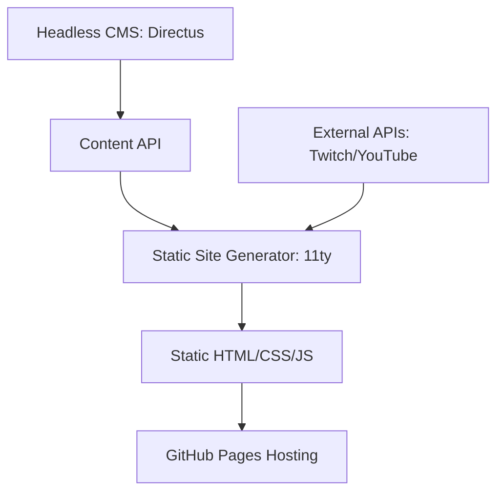
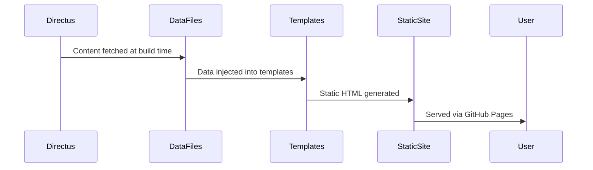
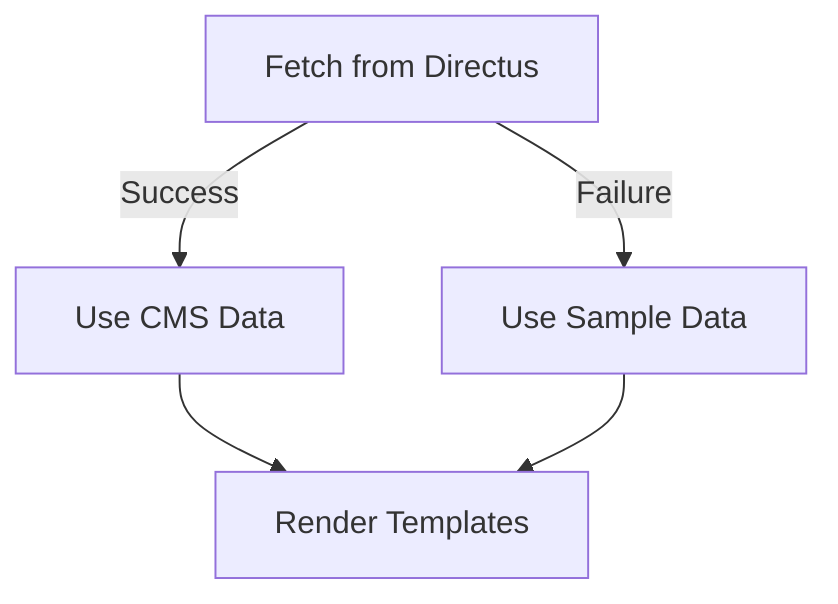
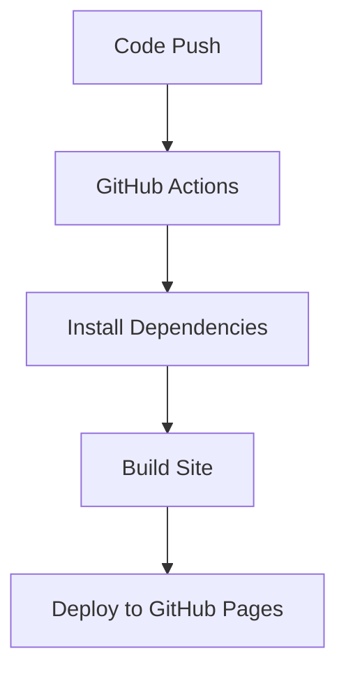

# System Patterns

## Architecture Overview

AlternaDevStudio.com follows a JAMstack architecture with a clear separation of concerns:



## Core Components

### 1. Static Site Generation (11ty)

The site uses Eleventy (11ty) as its static site generator with the following configuration:

- **Input Directory**: `src/`
- **Output Directory**: `_site/`
- **Templating Engine**: Nunjucks (`.njk`)
- **Data Directory**: `src/_data/`
- **Layouts Directory**: `src/_layouts/`
- **Includes Directory**: `src/_includes/`

### 2. Content Management (Directus)

Directus serves as the headless CMS with these key collections:

- **Blog Posts**: Articles written by team members
- **Projects**: Showcase of completed and in-progress work
- **Stream Recaps**: Summaries of live development streams

The Directus setup includes:
- PostgreSQL database for content storage
- Minio for S3-compatible file storage
- Docker Compose for local development

### 3. Data Flow Pattern

The site follows a clear data flow pattern:



### 4. Fallback Pattern

The site implements a robust fallback pattern for content:



Each data file (`blog_posts.js`, `projects.js`, `stream_recaps.js`) includes sample data that is used when:
- Directus is not running
- Authentication fails
- API requests fail

## Key Design Patterns

### 1. Module Pattern

The project uses ES modules for clean code organization:

```javascript
// Example from src/_data/utils/directus.js
export function createDirectusClient() {
  return createDirectus(directusUrl)
    .with(authentication())
    .with(rest());
}
```

### 2. Factory Pattern

The Directus client is created using a factory pattern:

```javascript
// Factory function to create a configured Directus client
export function createDirectusClient() {
  return createDirectus(directusUrl)
    .with(authentication())
    .with(rest());
}
```

### 3. Adapter Pattern

The data files act as adapters between Directus and 11ty:

```javascript
// Adapting Directus data for 11ty templates
export default async function() {
  // Fetch from Directus
  const posts = await client.request(
    readItems('blog_posts', {
      // Configuration...
    })
  );
  
  // Return adapted data for templates
  return posts;
}
```

### 4. Strategy Pattern

The content fetching implements a strategy pattern:

```javascript
// Try Directus first, fall back to sample data
const directusAvailable = await isDirectusAvailable();
if (!directusAvailable) {
  return getSampleBlogPosts();
}
```

## Testing Strategy

The project uses Jest for testing with a focus on:

1. **Directus Connection**: Testing the connection to Directus
2. **Collection Existence**: Verifying collections exist
3. **Field Validation**: Checking fields exist in collections
4. **Error Handling**: Testing fallback mechanisms

Tests are organized around collections:
- `tests/collections/blog_posts.test.js`
- `tests/collections/projects.test.js`
- `tests/collections/stream_recap.test.js`

## Deployment Pattern

The site uses GitHub Actions for CI/CD:



## Error Handling Patterns

The site implements several error handling patterns:

1. **API Availability Check**: Tests if Directus is running before attempting requests
2. **Authentication Fallback**: Falls back to sample data if authentication fails
3. **Request Error Handling**: Catches and logs errors from API requests
4. **Content Fallbacks**: Provides default content when CMS data is unavailable
